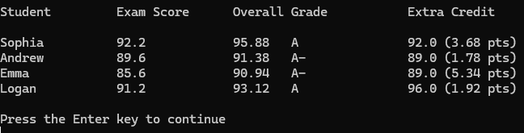

# Student Grading & Extra Credit Tracker

This C# console application automates the process of calculating, grading, and reporting student scores. It processes multiple student assignments, automatically distinguishes extra credit tasks, applies appropriate weighting, and generates a formatted academic report.

## 🎯 Project Objectives
* Iterate through datasets using robust `foreach` loops.
* Calculate core exam averages alongside extra credit contributions.
* Evaluate final overall scores using an standard `if-else` grading scale.
* Integrate extra credit weighting where extra credit assignments are worth exactly 10% of a standard exam's weight.
* Display formatted columns detailing Exam Score, Overall Grade, Letter Grade, and Extra Credit impact.

## 🛠️ Technical Highlights
* **Single-Pass Loop Efficiency:** Processes both core exam scores and extra credit elements within a single loop to maximize performance.
* **Precision Math:** Casts values to `decimal` to avoid integer division truncation issues, maintaining precise GPA statistics.
* **Data Formatting:** Uses native C# string formatting (`:F1` and `:F2`) to round averages to clear decimal places for professional output presentation.

## 📋 Sample Report Output



### Expected Console Output Text:
```text
Student         Exam Score      Overall Grade           Extra Credit

Sophia          92.2            95.88   A               92.0 (3.68 pts)
Andrew          89.6            91.38   A-              89.0 (1.78 pts)
Emma            85.6            90.94   A-              89.0 (5.34 pts)
Logan           91.2            93.12   A               96.0 (1.92 pts)

Press the Enter key to continue